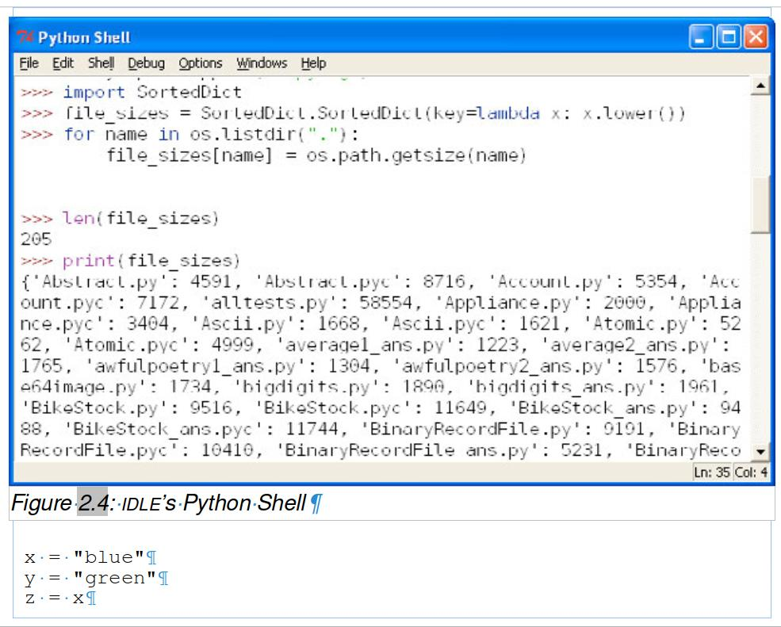
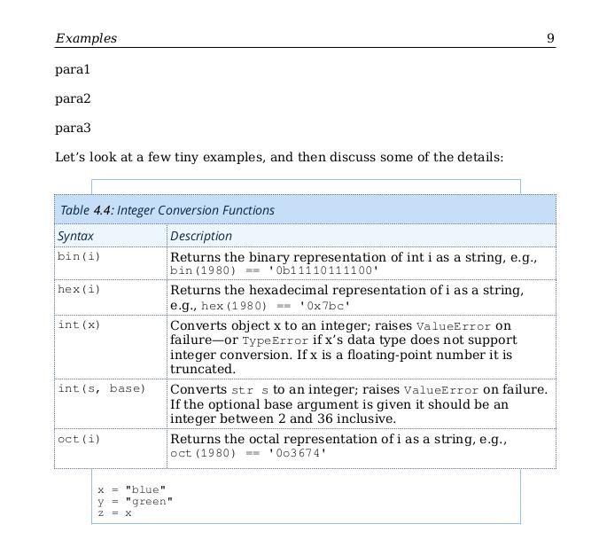
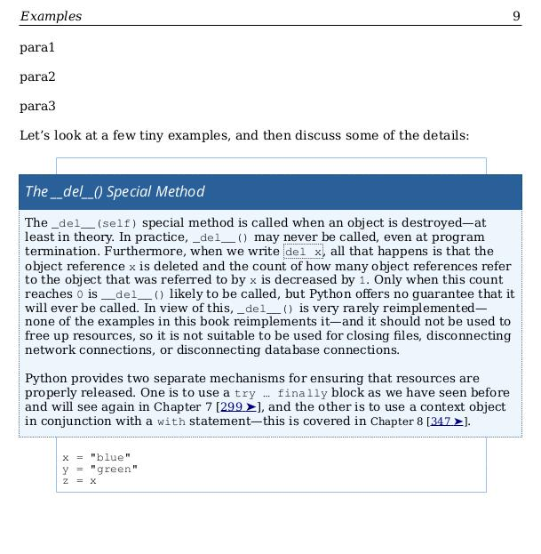
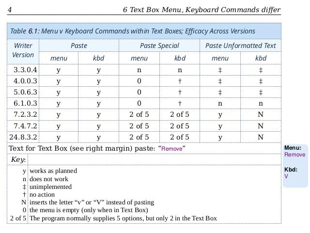
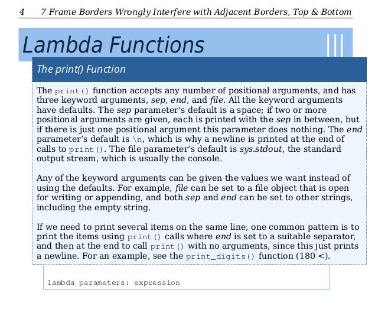

# Documentation for Python v3
## (*previous: Source Docs for Bug-Hunting*)

## Success     
<a name="2025-jan-06"></a>
I can well understand that you may not read every one of the statements below. The bottom line is that I've finally got a functional Programming-In-Python3 pdf. First a quick summary, with a fuller explanation of the setup in the final section (*‘Polishing’*):
<details>
           <summary>The Start</summary><br />       
           <p>See <a href=#2024-august-00>August 2024</a> in <a href=#timeline>The Timeline</a>. I wanted to learn Python & obtained <i>0_ProgrammingInPython3.pdf</i> at https://cs.smu.ca/~porter/.</p>
</details>
<details>
           <summary>Step 1: Two Near Misses & A Car Crash</summary><br />       
           <p><i>0_ProgrammingInPython3.pdf</i> proved NOT to have clickable links. I tried to add functional page-links into <i>1_Programming-In-Python3.odt</i>.</p>
           <p>See <a href=#2024-oct-17>17 October 2024</a>. LibreOffice 7.2.4.7 siezed up solid as I tried to update <a href=https://github.com/alexkemp9/Python3docs/blob/main/1_Programming-In-Python3.odt>1_Programming-In-Python3.odt</a>.</p>
           <p>See <a href=#2024-oct-19>19 October 2024</a>. LibreOffice 7.2.4.7 siezed up solid again as I tried to update <a href=https://github.com/alexkemp9/Python3docs/blob/main/2_scratch.odt>2_scratch.odt</a>.</p>
           <p>See <a href=#2024-oct-25>25 October 2024</a>. The whole computer siezed up solid as I tried to update <a href=https://github.com/alexkemp9/Python3docs/blob/main/3_new.odt>3_new.odt</a>.</p>
</details>
<details>
           <summary>Step 2: Autopsy</summary><br />       
          <p>See <a href=#appimage-installation>AppImage Installations</a>. What was locking the program & even the computer up so tight? A combo of my own mistakes & LibreOffice being riddled with bugs appeared to be part of the problem.</p>
          <p>Simple advice: Do not use the <i>Default Paragraph Style</i> (use Body Text, or design your own); do not attach a <a href=#frames>frame</a> (nor anything else) to a page (attach to a paragraph, etc.).</p>
</details>
<details>
           <summary>Step 3: Almost-Fix, Thwarted by Bugs</summary><br />       
          <p>See <a href=#2024-nov-27>27 November 2024</a>. A single multi-chapter ODT was failing, so I switched to create individual Chapters united under the umbrella of a Master Document. It almost worked.</p>
          <p>I could not persuade the Master Document to reproduce the <a href=https://help.libreoffice.org/7.1/en-US/text/swriter/guide/captions_numbers.html>chapter-numbering</a> that was present within each Chapter ODT for Images, Tables, etc..</p>
         <p><i>chapter_01.odt</i>, as an example, had images that had captions numbered <i>Figure 1.1</i>, <i>Figure 1.2</i>, and so on. In <i>chapter_02.odt</i> the image captions numbered <i>Figure 2.1</i>, and so on. The Master Document turned all that into <i>Figure 1</i>, <i>Figure 2</i>, and so on as a simple sequential number throughout the entire document. This was a bad bug and I reported it as <a href=https://bugs.documentfoundation.org/show_bug.cgi?id=164307>BugZilla 164307</a>. My report was ignored.</p>
</details>
<details>
           <summary>Step 4: Finally Fixed, Bugs Swatted En-Route</summary><br />       
          <p>See <a href=#2025-dec-06>06 January 2025</a>. My time during Step#3 above was spent removing every bug that I could find from each Chapter + placing Bookmarks into each Chapter so that the page-links could become effective.</p>
          <p>It dawned on me one evening that it should now be possible to assemble all the Chapters by hand & have a fully functioning Book!. That turned out to be true, although LibreOffice still had some midges right at the end to cause mayhem.</p>
          <p>The document <i>Programming-In-Python3 odt</i> was created. The 1st act was to import all styles from <i>chapter_15.odt</i>. The <i>First Page</i> + <i>Inside Cover</i> styles were acquired from the ODM, as was the first + second page content. Next it was important to make sure that <i>Heading Numbering</i> was setup before any chapters were added.</p>
         <p>The Introduction chapter (<i>chapter_00.odt</i>) was setup in the same way for all chapters: <pre>menu:Insert | More Breaks | Manual Break…</pre> was used to create a <i>Page Break</i> with <i>First Introduction Page</i> as the style. Each Chapter has a unique Page style.</p>
          <p>There were minor glitches along the way, but nothing major and it was all done very quickly since all the ingredients were already in place. The big bug arrived at the very end.</p>
          <p>After <i>Epilogue</i> + <i>Bibliography</i> were in place the Contents Index (page ii at the beginning) was created. A little after this I realised that all the Chapter / Header numbering in Images, etc. had switched itself OFF & the document now looked just like the Master Document did after auto-import. I have zero idea as to the exact action that caused this, but suspect that it may have been adding the index.</p>
          <p>Arghh!</p>
          <p>The difference between an ODT and an ODM is that the latter is read-only. Because this document was an ODT I could edit it. Selecting the 1st image number (it is a Field) and using &lt;Shift>-F10 (same as right-click in my Linux Desktop) then <i>Edit Fields…</i> showed that the Heading Number level selector was now empty. Restoring the value to “Level 1” and &lt;OK> restored the chapter numbering not just for that Image but for everything throughout the document. Hey, we were back in business.</p>
</details>
<details>
           <summary>Step 5: Polishing</summary><br />       
          <p>Finishing off often takes longer than Preparation & Action.</p>
          <p>My reason for starting was that the many (so-called) Hyperlinks in the original PDF were not actually active jumps. I had resolved to fix that.</p>
         <p>I got <i>0_ProgrammingInPython3.pdf</i> in August 2024. Finally, 4 months later, I had a stylish update in <i>Programming-In-Python3 odt</i>, but it still did not have accurate page-numbers for the target of the links. The technique that I had deployed reported the target-page as counted from the beginning of the document. I needed the hyperlink button to report the target as reported on the link-page. That meant changing <i>thousands</i> of hyperlinks. Oh dear; better to get it right first time.</p>
         <p>The Links fell into 2 groups: hyperlinks in the body of the text, and Jumpboxes (the latter positioned in the margins of the text). It is 9&nbsp;January 2024 and I've finished the body-text jumps. It was possible to insert a <i>Field | More Fields…</i> that reported the target book page number and also to place that field into the Hyperlink. Thus, if more pages are added or removed the page# in the jump will auto-change. The Jumpboxes — which are Writer Text Boxes — do not accept Fields as active fields; they only accept the Field text content.</p>
        <p>It has taken me an entire day to edit 2 chapters worth of Jumpboxes. It takes 25 steps involving 32 key presses or mouse click to edit each Jumpbox. There are 30&nbsp;Jumpboxes in Chapter&nbsp;1 & 18&nbsp;chapters in total. Yikes. This is what it looks like:
        <pre>What it takes to update each Jumpbox
------------------------------------
Example: "p051 jump" (1st jumpbox in Chapter 2 Data Types on Page#51)

With Navigator launched (&lt;F5>) & 'Drawing Objects' expanded:
(each Jumpbox is a Writer Text Box)

• Select jumpbox
• In Navigator, Mouse right-click | Edit…
&nbsp;&nbsp;(cursor is now inside the jumpbox +           )
&nbsp;&nbsp;(positioned at end of all contents            )
&nbsp;&nbsp;(this is the end of the hyperlink in each jumpbox)
• Press &lt;Home> key
• Hold down &lt;Shift> key + press &lt;End> key
• Press &lt;Ctrl>+k
&nbsp;&nbsp;(same as menu:Edit | Hyperlink)
• Target: 0.0.0.Piece #2: Object References|outline
• press &lt;Close> button
• press &lt;Esc> key
• choose an empty line in the text
• Press &lt;Alt>+i keys then &lt;d> then &lt;m>
&nbsp;&nbsp;(same as menu:Insert | Field | More Fields…              )
&nbsp;&nbsp;(Care! in Linux &lt;Ctrl>+&lt;F2> will switch to the 2nd screen)
• Select Type:Headings and Refer using:Page number (unstyled) in the Dialog
• Choose 'Piece #2: Object References' under Selection
• Press the &lt;Insert> button then &lt;Close>
• Select the Field just inserted into the Text & press &lt;Ctrl>+x or &lt;Shift>+&lt;Delete>
&nbsp;&nbsp;(this both puts the field into the Clipboard and removes it from the text)
• Select same jumpbox
• In Navigator, Mouse right-click | Edit
• Press &lt;Home> key†
• Press &lt;Ctrl>+k
• Click in Text:
• Press &lt;Home> key
• Hold down &lt;Shift> key & press &lt;right-arrow> to select all numbers
&nbsp;&nbsp;(numbers at the beginning of the Hyperlink refer to the page number)
• Press &lt;Ctrl>+v
&nbsp;&nbsp;(although it is pasting a Field, it only pastes the text-content, which is the page number)
&nbsp;&nbsp;(note that the previous number was the page as measured from the beginning of the document)
&nbsp;&nbsp;(which is NOT the number shown in the page                                                )
• Press &lt;Enter> key or &lt;OK> button
• Press &lt;Esc> key
• Choose the next jumpbox in the Navigator & do it all over again.

†It may seem peverse to first go to the beginning of the Hyperlink & only then select it. However, 
 there is a bug in Writer Text boxes, and possibly normal text as well. If the Hyperlink is selected
 from the End (rhs in Western text) and is then edited, when the &lt;OK> button is pressed it enters a
 *2nd* copy of the Hyperlink after the first. Thus, go to the beginning first.</pre></p>

</details>

<a name="2025-jan-13"></a>
### January 2025:

Programming-In-Python3.pdf is now 90% complete & a part of the [releases for download](https://github.com/alexkemp9/Python3docs/releases) (starting at 0.3-gamma).

Checking & fixing all the Jump-Boxes has been quite a slog     
(a Jump-Box is a Writer Text Box that contains a HyperLink to another part of the document).     

The raft of endemic bugs in LibreOffice has almost broken me. I discovered yet another near the end of this latest update:

The original author produced identically-named Headings. An example (not the only one) is:     
- 14 Introduction to Parsing | Writing Handcrafted Parsers | Simple Key–Value Data Parsing | p523
- 14 Introduction to Parsing | Pythonic Parsing with PyParsing | Simple Key–Value Data Parsing | p543
- 14 Introduction to Parsing | Lex/Yacc-Style Parsing with ply | Simple Key–Value Data Parsing | p559

The Contents utility has zero problem with this, but the Hyperlink process (`Ctrl-F5`) has a fatal problem with it, in that only the first in such links will work. I would love to report this to LibreOffice, but that would just be a waste of time (see [BugZilla #164307](https://bugs.documentfoundation.org/show_bug.cgi?id=164307) as one example).

### *Warning!*
In Sept 2024 the simple act of loading [“3_new.odt”](/3_new.odt) into Libreoffice caused the entire desktop computer to lockup & become unresponsive to anything other than the OFF power button on the case. Without any further action from me towards the ODT that has now, in Nov 2024, moderated into a LibreOffice freeze when the ODT is loaded, but not a System Freeze. YMMV     

The above was all under LibreOffice v7.4.7.2.

### Index:
| The Files (1<sup>st</sup> Attempt at Production) | Information Link |
| --- | --- |
|[0_ProgrammingInPython3.pdf](/0_ProgrammingInPython3.pdf)|[August 2024](#2024-august-00)|
|[ProgrammingInPython3.txt](Texts/ProgrammingInPython3.txt)|[August 2024 #1](#2024-august-01)|
|[1_Programming-In-Python3.odt](/1_Programming-In-Python3.odt)|[August 2024 #2](#2024-august-02)|
|[1_Programming-In-Python3.pdf](/1_Programming-In-Python3.pdf)|[August 2024 #2](#2024-august-02)|
|[2_scratch.odt](/2_scratch.odt)|[Oct 17 2024](#2024-oct-17)|
|[2_scratch.pdf](/2_scratch.pdf)|[Oct 17 2024](#2024-oct-17)|
|[3_new.odt](/3_new.odt)|[Oct 19 2024](#2024-oct-19)|
|[3_new.pdf](/3_new.pdf)|[Oct 19 2024](#2024-oct-19)|
|[4_paragraph-fix.odt](/4_paragraph-fix.odt)|[Nov 09 2024](#2024-nov-09)|
| (2<sup>nd</sup> Attempt) |   |
|[2_paragraph-fixes.odt](/2_paragraph-fixes.odt)|[Nov 20 2024](#2024-nov-20)|
| (3<sup>rd</sup> Attempt) |   |
|[chapter_00.odt](/chapter_00.odt) (etc. re: Master Documents)|[Nov 27 2024](#2024-nov-27)|
|Chapter / Heading Number Errors|[Dec 06 2024](#2024-dec-06)|
|Copy Errors|[Dec 07 2024](#2024-dec-07)|
|Frame Stats|[Dec 08 2024](#2024-dec-08)|
|Bug Docs|[Dec 10 2024](#the-bugs)|
| Bug#02 | [Dec 26 2024](#bug-02)
| Bug#03 | [Dec 29 2024](#bug-03)
| Bug#04 | [Dec 31 2024](#bug-04)
| Bug#05 | [Jan 01 2025](#bug-05)
| Bug#06 | [Jan 02 2025](#bug-06)
| Bug#07 | [Jan 04 2025](#bug-07)
|***Success!*** |[Jan 06 2025](#success)|
|[Programming-In-Python3.pdf](/Programming-In-Python3.pdf)|[Jan 13 2025](#2025-jan-13)|

- On [Dec 26](#bug-02) AppImages v5.0.6.3, v4.0.0.3 + v3.3.0.4 all proved to contain Bug03. Not good for more than 7⅓ years. But not to worry: LibreOffice is “*working as designed*”™.

***Dec 06 Update:*** Whilst attempting to compile the [tabulation of files + Chapter / Header Numbering](#2024-dec-06) my Devuan system locked up solid immediately after loading *4_paragraph-fix.odt*, and I had to use `Ctrl-Alt-F1` yet again to escape; this was under v7.2.3.2 Libreoffice. I cannot fathom this bug (or set of bugs, whatever it is). It's behaviour changes from day to day.

Note that my Devuan is currently Linux 5 daedalus, based on Debian stable, kernel 6.11.5+bpo-amd64 + fully updated each day.

It was still as buggy as can be under the 24.8.2 AppImage: the Status Bar Page-stats kept varying, as did the final page number. In addition, *Figure 15.1* kept intruding into the last pages, then was displayed within multiple other pages (the only action from me was to switch view to the last two pages). Fig 15.1 is shown on p563 of [“3_new.pdf”](/3_new.pdf), and that is completely wrong. It is not where it is supposed to be, nor where I placed it. Yet another bug.

***7 Nov update:*** The 24.8.2 AppImage version of Libreoffice has proven to be almost identical to the 7.4.7 version. After about 2 minutes the whole of LibreOffice dies & goes stiff. The only thing that I can do is to force-close the window. Not good.

### *Intentions*
The original intention of these documents was to show off how wonderful my updates to the Python3 PDF were. What it then became is a reference for Bug Reports to Libreoffice (LO). Those reports have been almost entirely ignored, so in Jan 2025 it has reverted to being a place to obtain *Programming-In-Python3 pdf* ([download from releases](https://github.com/alexkemp9/Python3docs/releases)).

### *Versions*
These are my current LO + OS versions:
- LibreOffice 7.4.7.2 40(Build:2)
- `$ lsb_release -ds` => “Devuan GNU/Linux 5 (daedalus)”
- `$ uname -srm` => “Linux 6.1.0-27-amd64 x86_64”

Under AppImage (installed 6 November 2024):
- LibreOffice 24.8.2.1

### *AppImage Installation*
The installation was done in a Terminal. Thus, what is shown below is at a user command-line:
```
$ cd /usr/local/bin
$ sudo wget https://appimages.libreitalia.org/LibreOffice-fresh.standard-x86_64.AppImage
$ sudo mv LibreOffice-fresh.standard-x86_64.AppImage LibreOffice-24.8.AppImage
$ sudo chmod a+x LibreOffice-24.8.AppImage
$ LibreOffice-24.8.AppImage --help
  LibreOffice 24.8.2.1 0f794b6e29741098670a3b95d60478a65d05ef13
$ sudo cp /usr/share/applications/libreoffice-startcenter.desktop /usr/share/applications/loappimage-startcenter.desktop
$ sudo nano /usr/share/applications/loappimage-startcenter.desktop
  # I changed the .desktop name + all Exec lines to begin “/usr/local/bin/LibreOffice-24.8.AppImage”,
  # but pretty much everything else was left unchanged
```
The new launch link was immediately within `menu:Office | LO AppImage Start Centre` & showed the correct LO version.

On Nov 14 the 24.8 AppImage was updated + the dir re-organised, in part using hard-links (`cp -l`). This is how the relevant files looked afterwards:-
```
$ la /usr/local/bin
total 927764
-rwxr-xr-x 2 root  root  334357696 Nov 14 12:47 LibreOffice-24.8.3.2.standard-x86_64.AppImage
-rwxr-xr-x 2 root  root  334357696 Nov 14 12:47 lo-24.8.AppImage
-rwxr-xr-x 1 root  root  280609984 May 22  2024 lo-7.2.AppImage
```
<a name="2024-dec-22"></a>
***22 Dec update:*** The 2nd response to [BugZilla #164295](https://bugs.documentfoundation.org/show_bug.cgi?id=164295) said that LO-6.1.0.0.alpha0+ is bug-free, that the latest 25.2.0.0.beta1+ version is still affected + that the bad commit was made in Dec 2019 at LO-6.5. Hmm. 5 years with zero fix for the image Caption error.

soluzioniopen.com contains a large list of [LibreOffice old-version AppImages](https://libreoffice.soluzioniopen.com/old-versions/). On December 22 I installed the v6.1.0.3 AppImage. The old-style graphics were a little jarring, but it was *very* pleasant to be running a version of LibreOffice that was NOT riddled with bugs that are *“[working as designed](https://bugs.documentfoundation.org/show_bug.cgi?id=164295#c4)™”*. Bug#2 ([pdf](./bug02%2B.pdf)) is absent in that version, although the Frame error of Bug#3 ([pdf](./bug03.pdf)) *is* present, meaning that it pre-dates the Caption bug - see [The Bugs](#the-bugs).

These are the relevant files within /usr/local/bin:
```
$ la /usr/local/bin/*AppImage
-rwxr-xr-x 2 root root 334357696 Nov 14 12:47 /usr/local/bin/LibreOffice-24.8.3.2.standard-x86_64.AppImage
-rwxr-xr-x 2 root root 334357696 Nov 14 12:47 /usr/local/bin/lo-24.8.AppImage
-rwxr-xr-x 1 root root 230778952 Aug  8  2018 /usr/local/bin/lo-6.1.AppImage
-rwxr-xr-x 1 root root 280609984 May 22  2024 /usr/local/bin/lo-7.2.AppImage
```

…and these are the relevant files within /usr/share/applications:
```
$ la /usr/share/applications/lo*
-rw-r--r-- 1 root root 21770 Nov  8 11:03 /usr/share/applications/lo-24.8-startcenter.desktop
-rw-r--r-- 1 root root 21762 Dec 22 10:59 /usr/share/applications/lo-6.1-startcenter.desktop
-rw-r--r-- 1 root root 21762 Nov  8 11:13 /usr/share/applications/lo-7.2-startcenter.desktop
```
The main usage-warning with multiple LO AppImages is to be careful that you shutdown completely from one version of LibreOffice before switching to another version, else you may suffer LO or even system-freeze.

## *Timeline*
Here is a timeline of production of each of these documents, and how they are linked to each other.
<a name="2024-august-00"></a>
### August 2024:
* The ultimate production of the Master Document: “Programming-In-Python3” ([ODM](/Programming-In-Python3.odm) / [PDF](/Programming-In-Python3.pdf)) began with [‘0_ProgrammingInPython3.pdf’](/0_ProgrammingInPython3.pdf) obtained at `https://cs.smu.ca/~porter/csc/227/ProgrammingInPython3.pdf`     
  (I wanted to learn Python 3)     
> Note:
<a name="2024-august-01"></a>
> The ProgrammingInPython3 PDF is chock-a-block with internal + external links, but none of those links are active. As I had a little time, I resolved to add those links into the PDF.
>
* [‘ProgrammingInPython3.txt’](Texts/ProgrammingInPython3.txt) obtained from [‘0_ProgrammingInPython3.pdf’](/0_ProgrammingInPython3.pdf) using `pdftotext`
>
<a name="2024-august-02"></a>
* Work began to convert [ProgrammingInPython3.txt](Texts/ProgrammingInPython3.txt) into [‘1_Programming-In-Python3.odt’](/1_Programming-In-Python3.odt) and thus into [‘1_Programming-In-Python3.pdf’](/1_Programming-In-Python3.pdf).
> It was during this work that most of the PNG files within [/Images](/Images) were obtained. It was also during this work that most of the TXT files within [/Texts](/Texts) were obtained using `tesseract` upon the PNG files.
### 17 Oct 2024:
* Conversion work crashed & burned *after* I saved [‘1_Programming-In-Python3.pdf’](/1_Programming-In-Python3.pdf) (see p586 (“Summary”, final chapter)).
>Note:
> I believe that I was in process of creating “Epilogue” + “Selected Bibliography” when the program just froze [NOT a system freeze] but made no notes & cannot now recall precise details
>
<a name="2024-oct-17"></a>
* Work then began to convert [‘1_Programming-In-Python3.odt’](/1_Programming-In-Python3.odt) into [‘2_scratch.odt’](/2_scratch.odt) and thus into [‘2_scratch.pdf’](2_scratch.pdf)
### 19 Oct 2024:
* Conversion work crashed & burned *after* completing all chapters (including “Epilogue” + “Selected Bibliography” but not the Index) and whilst preparing the Contents listing.
>Note:
> I was beginning to pull my hair out at this stage. Almost all work had been completed. I had zero idea why I should be experiencing problems & therefore no idea as to how to fix it.
>
> One feature of the work that I was inexperienced with was integration of drawing elements (eg arrows) with Tables (Figure 12.1 on p474 of [2_scratch.pdf](2_scratch.pdf) is an example; Figure 15.1 on p565 is another).
>
> I resolved to convert all these draw examples into PNG images & try one more time.
>
<a name="2024-oct-19"></a>
* Work began to convert [‘2_scratch.odt’](/2_scratch.odt) into [‘3_new.odt’](/3_new.odt) and thus into [‘3_new.pdf’](3_new.pdf)
> After changing all problematic draw-elements on each page into PNG images, I was then able to produce the “Contents at a Glance” (p3 of [‘’](/)) without any problems. It seemed to me that I should produce a “List of Tables, Sidebars + Figures” first, then a Contents listing, and finally add a “Contents at a Glance” page. The last act would be to correct the jump targets for all forward-jump boxes + correct all Chapter links in the text. The first part (Tables listing) went without problems. However, after completing that LO simply refused to produce any Contents, though without any error message.
### 25 Oct 2024:
* (the day before my 75th birthday) My entire computer crashed & burned as I loaded up [‘3_new.odt’](/3_new.odt) to try (yet again) to produce a Contents listing. In a state of disbelief I shut the computer down via the physical power button. Devuan successfully auto-restored the Journal on restart. In a state of some shock — I was used to this with Windows, but thought that I had left it all behind with Linux — I tried again with nothing else loaded. Just a second or two after loading up ‘3_new.odt’ the mouse stopped moving & everything froze. I got to the command line with `Ctrl-Alt-F1`, logged in & entered `startx` to get back to the desktop then shut down normally.
* My final act on this occasion  was to use `libreoffice --convert-to pdf:writer_pdf_Export 3_new.odt` in a terminal to get a PDF (which was successful).
 ### 09 Nov 2024:
Two significant steps forward on the same day:     
  1. A post by me within the  [dev1galaxy.org forum](https://dev1galaxy.org/viewtopic.php?id=6915) had produced responses that suggested that *ealier* versions of LO could run [“3_new.odt”](/3_new.odt) without freezing nor dying. After installing *"LibreOffice-7.2.3.2.basic-x86_64.AppImage"* from [AppImages listing](https://appimages.libreitalia.org/) I was able to prove that yes, those were accurate reports.
  2. A response to a post by me within [ask.lo.org](https://ask.libreoffice.org/t/re-my-odt-froze-my-computer-i-had-to-press-the-power-button/113458) had stated that my extensive use of *Direct Paragraph Formatting* (sic) rather than *Body Text* was responsible for the increased load, since *“Direct formatting puts stress on Writer because every occurrence must be handled individually whereas style effects can be cached and reused at will”*. Such a design feature appeared to me to be rather stupid but, sure enough, experimentation seemed to show it to be true.

Later Comment on ***“Direct Paragraph Formatting”*** within the [ask.lo.org answer](https://ask.libreoffice.org/t/re-my-odt-froze-my-computer-i-had-to-press-the-power-button/113458):     
    At the time I read *“Direct Paragraph Formatting”* as a mis-type for *“Default Paragraph Style”*. That writer is obsessed with *any* use of direct format by someone asking for help, and immediately uses it as a stick to beat the questioner with. Having re-read the answer, I am now unsure as to whether that writer was referring to *Default Paragraph Style* or not.

This is ***Libreoffice Writer Styles***:–

> * ***Stylesheets:*** LO makes use of *Stylesheets* (similar to html *CSS*), referred to in LO as *“Styles”*. Each is a collection of format settings that all apply within one particular scenario.
> * ***Writer Style Scenarios:*** Page, Paragraph, Character, Frame, List, Table.
> * ***Style Cascade:*** One style within each scenario is the default from which all others in the same scenario are directly or ultimately derived.
> * ***Style Values:*** Less work for the author + a more professional appearance.
> * ***Direct Format:*** It is still possible to directly change any format setting within the page, paragraph, etc..
    
*  [‘3_new.odt’](/3_new.odt) loaded up under 7.2.3.2 & allowed me to operate LO.     
`Ctrl-h` gave Search+Replace. Using "Paragraph Styles" I searched for "Default Paragraph Style" & replaced with "Text Body". (Note: in 24.8.2 "Text Body" style has been renamed to "Body Text").     
  <a name="2024-nov-09"></a>
I changed all 57 Introduction paragraphs in *3_new.odt* from *"Default Paragraph Style"* to *Body Text* and then saved the ODT as  [‘4_paragraph-fix.odt’](/4_paragraph-fix.odt). Opening *4_paragraph-fix.odt* again all the excess load was magically gone. Good Lord.
* The initial magic of *4_paragraph-fix.odt* evapourated almost immediately as I continued with the default-paragraph changes. In addition, the bugs in *3_new.odt* had caused various elements to change position, and all of those needed fixing as well. The excess load issue reappeared the next day & did not go away. This new document was now beginning to show all the same symptoms as the old ones, plus a few new ones of it's own. I resolved to abandon this line of documents and to try anew with one of the original documents.
 ### 20 Nov 2024:
  <a name="2024-nov-20"></a>
* Begininng again with [‘1_Programming-In-Python3.odt’](/1_Programming-In-Python3.odt) under 7.2.3.2 I saved it as [‘2_paragraph-fixes.odt’](/2_paragraph-fixes.odt), and using `Ctrl-h` replaced every instance of 'Default Paragraph Style' with 'Text Body' style + a host of other changes. That enabled me to open the document under 7.4.7 and, after 10 seconds, the load fell to a minimal level. (False dawn; the next day it was back to continual load). This continued though every Chapter, including Epilogue & Bibliography. Next was to create a *Table of Contents*. I went through all the motions to do that, but nothing happened.

## Interim Summary:

1. The first line of construction clearly had hit a brick wall (4 months: *[](/)* through to *[4_paragraph-fix.odt](/4_paragraph-fix.odt)*).     
2. The second line of construction had also hit yet another brick wall (11 days: *[‘1_Programming-In-Python3.odt’](/1_Programming-In-Python3.odt)* to *[2_paragraph-fixes.odt](/2_paragraph-fixes.odt)*).     
3. I don't like hitting brick walls. I needed to take another route, so decided to do this via a Master Document instead.
 ### 27 Nov 2024:
  <a name="2024-nov-27"></a>
* The first issue was to produce 18 chapters ([‘chapter_00.odt’](/chapter_00.odt) to  ([‘chapter_15.odt’](/chapter_15.odt) + ([‘Epilogue.odt’](/Epilogue.odt) + ([‘Bibliography.odt’](/Bibliography.odt)) and a Master Document ([‘Programming-In-Python3.odm’](/Programming-In-Python3.odm)). This time I hit the brick wall instantly with Chapter / Heading numbering, but at least I was able to find the fix after a short while. Though not yet (Dec 06) for the same issue in Master Documents.
### Chapter / Heading Numbering
***Bottom Line:***     
It is the order in which `Chapter Numbering…` and `Heading styles` are setup that will decide whether *Chapter Numbering* is switched on or not.
> * *Chapter Numbering…* needs to be setup first
> * *Heading styles* need to be used last
> * (the info above is not in any [documentation](https://help.libreoffice.org/7.4/en-US/text/swriter/01/06060000.html) that I have seen, nor known about by the [experts I consulted](https://ask.libreoffice.org/t/cannot-number-a-chapter-in-a-figure-table-caption-etc/114155/9))
> * Note: LO v7 & earlier call the menu item `menu:/Tools/Chapter Numbering…`.  Below is the dialog:
> * Later versions call the same menu item `menu:/Tools/Heading Numbering…`. Below is Tab#2 of the dialog:
>      
>      

I setup all my Header 1, 2, 3 + 4 styles first in each document that I built, and then tried to setup Chapter Numbering (it failed every time, because that was the wrong order - see above). After a while I tried to use *“Drawing”* as a replacement field, but that is not an effective substitute.

Having discovered the undocumented ‘trick’ to be able to switch *Chapter / Heading Numbering* ON I also discovered that doing so inserted the Chapter Number into all Headings at that level when they were created. Why? !!! It may be reasonable as an option, but surely not as a requirement. The *“H1 Auto-number”* Character style that I created was my means to hide that number in the Headings; a 2pt number in DejaVu Sans Condensed with the same #95BFEC font colour as the Heading background does the job there, and does not affect the field use in other circumstances.

Once I had discovered the correct 2-stage order to switch on Chapter / Heading numbering, inserting *“x.y”* *Figure* + *Table* numbers became a breeze (in which x == current Chapter number auto-inserted, and y == *Figure + 1* or *Table + 1* in order to get auto-incrementing numbers. That works fine. Although not yet in Master documents.

Here is a tabulation of the documents re: Chapter numbering; unmentioned files are the same as their predecessor:–
<a name="2024-dec-06"></a>
| Document | Chapter / Heading Numbering |
|:---:|:---: |
| 1_Programming-In-Python3.odt | Inoperative |
| 2_paragraph-fixes.odt | *Drawing* as a substitute field |
| chapter_02.odt | Operative<br>(not operative is Master documents)     
(back-ported into chapter_00 + chapter_01) |
### 07 Dec 2024:
I was dealing with so many different bugs in Writer by this stage that my head was spinning. I was having difficulty both in spotting any common theme between the bugs, and also how on earth could I sensibly & simply report them to others? Then I had a bright thought.

One common theme between the original errors & the Master document errors was transfer from one document to another. The bright thought was that it should be possible to measure that, and measurement is something that everyone at every level can understand.

<a name="2024-dec-07"></a>
In the following tabulation I used the Status bar (bottom left) +  the Writer *Navigator* (switch it on/off with Function Key #5 (`F5`) or `menu:/View/Navigator`) to measure the stats of various components of [1_Programming-In-Python3.odt](/1_Programming-In-Python3.odt) under both LO 7.2.3.2 + 24.8.3.2. The entire document was then selected using both `Ctrl-A` & mechanical selection with mouse (word & character stats were identical in both cases) & copied using `Ctrl-C`. That was then pasted into a new, blank sheet using `Shift-Ctrl-V (select LO doc)` and measured again.
### Copying Errors
| 7.2.3.2 | Original | Copy | Diff | % |
|:---:|---: |---:|---:|---:|
| Pages | 666 | 556 | -110| -17% |
| Words | 232,206 | 226,263 | -5,943 | -2.6%  |
| Words (selection) | 223,631 |  | -2,632 | -1.2% |
| Characters | 1,392,176 | 1,356,358 | -35,818 | -2.6% |
| Chars (selection) | 1,340,553 |  | -15,805 | -1.2% |
| Headings | 241 | 241 |0 | |
| Tables | 105 | 68 | -37 | -35% |
| Frames | 77 | 33 | -44 | -57% |
| Images | 39 | 35 | -4 | -5.2% |
| OLE objects | 3 | 3 | 0 ||
| Bookmarks | 52 | 40 | -12 | -23% |
| Hyperlinks | 114 | 113 | -1 | -0.9% |
| References | 7 | 7 | 0 ||
| Drawing Objects | 689 | 634 | -5 | -0.7% |
| Fields | 262 | 253 | -9 | -3.4% |     
     
      
Almost one fifth of the pages are not transferred on copy/paste?     
     
      
| 24.8.3.2 |Original | Copy | Diff | % | cf v7 |
|:---:|---: |---:|---:|---:|:---:|
| Pages | 664 | 558 | -106| -16% | different |
| Words | 232,206 | 226,263 | -5,943 | -2.6%  | same |
| Words (selection) | 223,631 |  | -2,632 | -1.2% |  same |
| Characters | 1,392,176 | 1,356,358 | -35,818 | -2.6% | same |
| Chars (selection) | 1,340,553 |  | -15,805 | -1.2% | same |
| Headings | 241 | 241 |0 | | same |
| Tables | 105 | 68 | -37 | -35% | same |
| Frames | 77 | 33 | -44 |- 57% | same |
| Images | 39 | 35 | -4 | -5.2% | same |
| OLE objects | 3 | 3 | 0 || same |
| Bookmarks | 52 | 40 | -12 | -23% | same |
| Hyperlinks | 114 | 113 | -1 | -0.9% | same |
| References | 7 | 7 | 0 || same |
| Drawing Objects | 689 | 634 | -5 | -0.7% | same |
| Fields | 240 | 237 | -3 | -1.3% | different |
| Footnotes | 72 | 72 | 0 |  | no comparison |

***Bottom line:*** Both v7 + v24.8 are unable to copy then paste all components of an odt. That is a bad set of bugs.

<a name="2024-dec-08"></a>
Frames had the largest proportion of failures during transfer ( 57%). So, the obvious next step was to try to identify what was causing so many Frame errors during copying. The following stats were collected under 24.8.3.2:
> ✔ == yes, is copied fine     
> ✘ == no, is NOT transferred during copy/paste     
### Frame Stats
| Serial |Page | Name | Image | Table | Sidebar | Drawing Object |
|---:|:---: |:---:|:---:|:---:|:---:|:---:|
|1| p014 |figure 1.1 |✔| | | |
|2| p017 |figure 1.2 |✔| | | |
|3| p033 |figure 1.4 |✔| | | |
|4| p032 |figure 1.3 |✔| | | |https://bugs.documentfoundation.org/show_bug.cgi?id=164307
|5| p066 |Table 2.7 | | ✘| | |
|6| p069 |figure 2.1 |✔| | | |
|7| p071 |figure 2.3 |✔| | | |
|8| p070 |figure 2.2 |✔| | | |
|9| p071 |figure 2.4 |✔| | | |
|10| p099 |figure 2.7 |✔| | | |
|11| p116 |Deleting Items… || |✔| |
|12| p122 |figure 3.3 || | |✘|
|13| p123 |figure 3.4 |✔| | | |
|14| p128 |figure 3.5-d3 || | |✔|
|15| p128 |figure 3.5-d2 || | |✔|
|16| p128 |figure 3.5-d1 || | |✔|
|17| p128 |figure 3.5-d6 || | |✔|
|18| p128 |figure 3.5-d4 || | |✔|
|19| p128 |figure 3.5-d5 || | |✔|
|20| p128 |figure 3.5-d7 || | |✔|
|21| p130 |Table 3.3 | | ✘| | |
|22| p132 |Read Write… || |✘| |
|23| p142 |Table 3.4 | | ✘| | |
|24| p166 |figure 4.1 |✔| | | |
|25| p167 |figure 4.2 |✔| | | |
|26| p174 |Online Doc… || |✘| |
|27| p183 |print() Fun… || |✘| |
|28| p239 |figure 6.1 |✔| | | |
|29| p244 |Table 6.1 | | ✘| | |
|30| p251 |Figure 6.3 | | ✘| | |
|31| p252 |Table 6.2 | | ✘| | |
|32| p252 |del_() Spe… || |✔| |
|33| p255 |Table 6.3 | | ✘| | |
|34| p264 |figure 6.6 |✔| | | |
|35| p267 |Table 6.4 | | ✘| | |
|36| p280 |Generator Fun… || |✘| |
|37| p290 |Figure 7.1 | | ✘| | |
|38| p291 |Figure 7.2 | | ✘| | |
|39| p295 |Bytes and Byte… || |✘| |
|40| p298 |Struct Module… || |✘| |
|41| p349 |Table 8.1 | | ✘| | |
|42| p314 |Table 8.2 | | ✘| | |
|43| p379 |Table 8.3 | | ✘| | |
|44| p381 |Table 8.4 | | ✘| | |
|45| p398 |Figure 8.2 | | ✘| | |
|46| p421 |figure 9.2 |✔| | | |
|47| p420 |figure 9.1 |✔| | | |
|48| p437 |Figure 10.1 | | ✘| | |
|49| p440 |figure 10.2 |✔| | | |
|50| p442 |Figure 10.3 | | ✘| | |
|51| p475 |Table 12.1 | | ✘| | |
|52| p476 |Table 12.2 | | ✘| | |
|53| p486 |Table 13.1 | | ✘| | |
|54| p487 |Table 13.2 | | ✘| | |
|55| p492 |Table 13.3 | | ✘| | |
|56| p496 |Table 13.4 | | ✘| | |
|57| p496 |Table 13.5 | | ✘| | |
|58| p502 |Table 13.7 | | ✘| | |
|59| p510 |Figure 14.1 | | ✘| | |
|60| p511 |Figure 14.2 | | ✘| | |
|61| p512 |Figure 14.3 | | ✘| | |
|62| p514 |Figure 14.4 | | ✘| | |
|63| p514 |Figure 14.5 | | ✔| | |
|64| p517 |Figure 14.6 | | ✘| | |
|65| p517 |Figure 14.7 | | ✘| | |
|66| p520 |Figure 14.9 |✘| | | |
|67| p521 |Figure 14.12 | | ✘| | |
|68| p520 |Caption 14.9 |✔| | | |
|69| p520 |Caption 14.11 |✔| | | |
|70| p522 |Figure 14.13 |✘| | | |
|71| p522 |Figure 14.14 |✔| | | |
|72| p543 |Figure 14.15 | | ✘| | |
|73| p565 |Figure 15.1 || | |✔|
|74| p567 |Figure 15.2 |✔| | | |
|75| p573 |Figure 15.4 |✘| | | |
|76| p583 |Figure 15.6 |✔| | | |
|77| p584 |Figure 15.7 | | ✔| | |
|||Totals:| 25 (32%) : 22✔ 3✘ | 35 (45%) : 2✔ 33✘ | 8 (10%) : 2✔ 6✘ | 9 (12%) : 2✔ 7✘ |
### Frames
The [current Libreoffice Help on Frames](https://help.libreoffice.org/latest/en-US/text/swriter/guide/text_frame.html) states:
> A frame is a container for text and graphics that you can place anywhere on a page. You can also use a frame to apply a column layout to text.

A [vital LO Wiki page on Page-Anchoring](https://wiki.documentfoundation.org/Faq/Writer/AnchoringAndPositioning) unambiguously points out that *"(page-anchored) objects present in text documents will disappear from the master documents referencing those text documents”*. Whoops. Well, it would have been nice to have been warned at the point of trying to paste / transfer, rather than just posting a Notice attached to a wall on the other side of the County.

It is obvious from the name that a Frame was originally designed to encapsulate an Image (putting a *“Frame around a Picture”*). In fact, the Wiki linked above states: *“Every image that is inserted into Writer is associated or assigned to the ‘Graphics’ Frame style”*. Also, the act of adding a Caption auto-adds a Frame to the object, with the caption placed within the Frame, either above or below the object. That does mean that every Image+Caption will auto-contain 2 Frames (and also 2 paragraphs + a text-box).

Checking the non-transfer Images above, all were anchored to a Page. The successfully-transferred Tables above were all anchored to a Paragraph yet other Tables were not. This all answers why those items did (or did not) transfer.

The *Sidebars* are pure-Frame items that contain text. Once again, the couple that successfully transferred are anchored to a paragraph, whilst the others are all anchored to the page. There is a pattern emerging here.

I did not bother checking the Drawing Objects that were framed. I got disenchanted very early on with the way that they became hobos & wandered all over the pages, and thus converted all of them into PNG files to stop their vagrant manner.

## The Bugs
Use [the link](https://bugs.documentfoundation.org/enter_bug.cgi?product=LibreOffice;bug_status=UNCONFIRMED;version=?) on the Libreoffice Wiki page [How to Report Bugs in LibreOffice](https://wiki.documentfoundation.org/QA/BugReport) to go to Bugzilla to report an LO Bug, since the [report page from Bugzilla](https://bugs.documentfoundation.org/enter_bug.cgi?product=LibreOffice&format=guided) has a blocking bug of it's own (it always says that the 'Version' has NOT been entered, even if it has) (oh, the irony).

I wrote down some of the LO Bugs that I was experiencing, but only after the show-stopping bug. Here's my record:

1. ~~Copy + Paste sometimes omits Tables. It seems that only Tables that are NOT encapsulated with a Frame will be copied~~.

Many bug-issues on Frames have now (Dec 2024) been answered above (see [Frames](#frames)). In short, do not anchor a Frame to a page.

***Dec 19 Update:*** The *“List of Tables, Sidebars + Figures”* in the Master Document ([ODM](/Programming-In-Python3.odm) / [PDF](/Programming-In-Python3.pdf)) has had duplications throughout the end of the list. I could find no reason why until yesterday. Whilst updating page-links in *Chapter 10* (starts p445) I discovered that the 3 Images in that chapter were missing from the Master Document. Sure enough, all 3 were anchored to the Page. Changing the anchorage for all 3 + re-updating not only restored the images to the document but also removed all dupes from the Tables’ list.

If I can now re-find how I originally managed to add Sidebars within that List it will be good to go.

### Bug #02

2. #### In Writer v24.8.3.2, selecting the whole of an Image caption also selects the image

> [Bugzilla – Bug 164295](https://bugs.documentfoundation.org/show_bug.cgi?id=164295)
>
> If the caption is then deleted the image itself will also be deleted.
>
> The Caption position relative to the Image is decided by a Frame that encloses the image. In their turn, both caption + framed image are enclosed within a Paragraph, and that paragraph is enclosed within a Text-Box and, just in case you did NOT realise that this is just like a Russian Doll, the text-box is also Framed.
>
> The image Frame is *supposed* to isolate image from caption and, most certainly, any human Editor would expect to be able to delete the Caption contents & leave the Image untouched. Somehow, the Caption text entity bleeds into the Image entity and that makes no sense. This is rather like selecting a single word in a sentence & then discovering that the system has selected the entire paragraph for you. In my mind, Frames should isolate entities one from the other, yet they appear to be performing the reverse act.
>
> Whilst producing the bug-report document it was discovered that a paragraph-with-inline-border below the image (see bug#3 below) suffers a similar problem. ~~So, if the whole of the paragraph is selected, then the image+caption+paragraph will all be selected). Then, if the paragraph is deleted all 3 (image, caption + paragraph) will be deleted.~~
>
>> ***Dec 26 Update:*** content.xml within the bug02+ ODT indicates interference between the image+caption frame & the added lower paragraph. It may well be that the entire problem is a frame bug rather than an image or caption bug.
>>
>> ***Dec 27 Update:*** content.xml within the bug02+ ODT is maintained within this github as [bug02+24.8-content.xml](./bug02%2B24.8-content.xml). In other words, the upto-date content file is extracted from that ODT and then stored under that name. The ODT itself was edited + saved under 24.8.3.2. `menu:Help | About LibreOffice` shows [Build](https://gerrit.libreoffice.org/gitweb?p=core.git;a=log;h=48a6bac9e7e268aeb4c3483fcf825c94556d9f92).
>>
>> ***Dec 29 Update:*** Since the Image+Caption are attached to a paragraph it is important to realise that selecting the whole of that paragraph & deleting it will, of course, also delete the image + caption, since it will delete *everything* that is within the paragraph. However, the 2nd issue discovered within Bug#02 is different from that. It is rather that the Image+Caption frame interferes with the borders of the text-objects that surround it. I've managed to isolate the issue & display it in a manner that it can be discerned & understood more clearly. That has been placed into [Bug#03](#bug-03) below.
>> 
>> The 4th example demonstrated within Bug02+ ([ODT](./bug02%2B.odt) • [PDF](./bug02%2B.pdf)) is actually a dupe of Bug#03 below. I've tested under both 5.0.6.3 and 4.0.0.3, and then the oldest version available (3.3.0.4) and all of these versions contain the bug.
>>
>>  In the *content.xml* the paragraph *xml* for the 1st line of the Code Box 2 gets stripped away & the text of that paragraph gets injected into the bottom of the image+caption xml instead (*inside* the outermost Frame). It should therefore be zero surprise that the top border of the *Code Box 2* text gets placed *above* the image+caption. This is a bad & obvious bug, and I am amazed that it goes back so far (the oldest available AppImages are dated Aug 12  2017 and they all contain this bug).

> 
> This can be viewed within [bug02.odt](./bug02.odt) + [bug02.pdf](./bug02.pdf); extended updates within [bug2+.odt](./bug02%2B.odt) + [bug2+.pdf](./bug02%2B.pdf)

The bug was reported to BugZilla on Dec 12 2024. 2 weeks later there have been 3 significant responses and, if you have been unable to understand why LibreOffice has been riddled with bugs for the last 5 years, you are about to discover the reason why:-     
- 2024-12-16: ***raal***: LO 25.2.0.0.beta1+ still affected by this bug
- 2024-12-16: ***raal***: LO 6.1.0.0.alpha0+ unaffected by the bug
- 2024-12-16: ***raal***: Bug began at commit 6.5 on Fri Dec 6 14:04:55 2019 +0100
  (raal asks Michael Stahl to take a look)
- 2024-12-17: ***Stahl***: this is working as designed.

### Bug #03

3. #### In Writer v24.8.3.2, Image Frames Interfere with Adjoining Borders

> [Bugzilla 164297](https://bugs.documentfoundation.org/show_bug.cgi?id=164297)
>
>> ***Dec 29 Update:*** This is essentially the 4th example of Bug#02+ above. However, these 2 reports for Bug#02 are independent of each other (to my best belief) so this one has been reported separately as Bug#03. In addition, on 29 December I managed to complete a fuller & better ODT + PDF report. The ODT itself was edited + saved under 24.8.3.2. `menu:Help | About LibreOffice` shows [Build](https://gerrit.libreoffice.org/gitweb?p=core.git;a=log;h=48a6bac9e7e268aeb4c3483fcf825c94556d9f92).
>> 
>> The Image+Caption Frame “Interferes” with adjoining borders. The bug occurs with anything that is framed and is positioned next to something with a border. The interference ranges from changing bottom- or top-spacing, and can be minor or become splitting off embedded borders from the text to which they are supposed to be attached. This makes best sense when viewed in place, and I've spent a couple of days creating an ODT to show that ([bug3+.odt](./bug03%2B.odt)).
>>
>> Seeing is believing     
>> (the top of the *Code Box 2* paragraph’s blue border is at the top of the screenshot, whilst the rest of that border is at the bottom):
>> 
>>      
>
> This can be viewed within [bug03.odt](./bug03.odt) + [bug03.pdf](./bug03.pdf); extended updates are within [bug3+.odt](./bug03%2B.odt) + [bug3+.pdf](./bug03%2B.pdf)

### Bug #04

4. #### In Writer v24.8.3.2, Table Frames Interfere with Adjoining Borders

>  [Bugzilla 164298](https://bugs.documentfoundation.org/show_bug.cgi?id=164298)
>
>> ***Dec 31 Update:*** This seems to essentially be identical to Bug#03+ above. On 31 December I managed to complete a fuller & better ODT + PDF report. The ODT itself was edited + saved under 24.8.3.2. `menu:Help | About LibreOffice` shows [Build](https://gerrit.libreoffice.org/gitweb?p=core.git;a=log;h=48a6bac9e7e268aeb4c3483fcf825c94556d9f92).
>>
>> The Framed Table “Interferes” with adjoining borders. The bug occurs with anything that is framed and is positioned next to something with a border. The interference ranges from changing bottom- or top-spacing, and can be minor or become splitting off embedded borders from the text to which they are supposed to be attached.
>>
>> The clearest demonstration of the bug is when the below-frame spacing of the table-in-frame is added to the internal top-spacing  of the next paragraph, rather than being placed between the two entity’s borders.
>> 
>>  This makes best sense when viewed in place, and I've spent a couple of days creating an ODT to show that ([bug4+.odt](./bug04%2B.odt)).
>
> This can be viewed within [bug4.odt](./bug4.odt) + [bug4.pdf](./bug4.pdf), and is almost certainly a Frame bug rather than a Table bug, and thus a dupe of bug#3; extended updates are within [bug4+.odt](./bug04%2B.odt) + [bug4+.pdf](./bug04%2B.pdf).
>>
>> Seeing is believing     
>> (the top of the *Code Box 2* paragraph’s blue border is near the top of the screenshot, whilst the rest of that border is at the bottom):
>> 
>>      

### Bug #05
5. #### In Writer, Text Frames Interfere with Adjoining Borders

> [Bugzilla 164302](https://bugs.documentfoundation.org/show_bug.cgi?id=164302)
>
>> ***Jan 01 Update:*** This seems to essentially be identical to Bugs #02, #03 + #04 above. I managed to complete a fuller & better ODT + PDF report. The ODT itself was edited + saved under 24.8.3.2. `menu:Help | About LibreOffice` shows [Build](https://gerrit.libreoffice.org/gitweb?p=core.git;a=log;h=48a6bac9e7e268aeb4c3483fcf825c94556d9f92).
>>
>> The SideBar (a Text Frame) “Interferes” with adjoining borders. The bug occurs with anything that is framed and is positioned next to something with a border. The interference ranges from changing bottom- or top-spacing, and can be minor or become splitting off embedded borders from the text to which they are supposed to be attached.
>>
>> The clearest demonstration of the bug is when the below-frame spacing of the text frame is shown to be added to the internal top-spacing  of the next paragraph, rather than being placed between the two entity’s borders, due to the 2nd entity being a blue-bordered text paragraph.
>> 
>>  This makes best sense when viewed in place, and I've spent a couple of days creating an ODT to show that ([bug5+.odt](./bug05%2B.odt)).
> The bottom border of a Sidebar (which is a frame that contains text) will coalesce with the top inline-border of a paragraph. In other words, the below-frame spacing of the frame will be added to the internal top-spacing  of the next paragraph, rather than being placed between the two entity’s borders.
>
> This can be viewed within [bug05.odt](./bug05.odt) + [bug05.pdf](./bug05.pdf), and is almost certainly a dupe of bug#2 + bug#3 + bug#4; extended updates are within [bug5+.odt](./bug05%2B.odt) + [bug5+.pdf](./bug05%2B.pdf).. An example can also be seen on p293 of [‘3_new.pdf’](3_new.pdf).
>>
>> Seeing is believing     
>> (the top of the *Code Box 2* paragraph’s blue border is near the top of the screenshot, whilst the rest of that border is at the bottom):
>> 
>>      

### Bug #06
6. #### In Writer, Text Box Menu, Keyboard Commands differ in Efficacy

> [Bugzilla 164303](https://bugs.documentfoundation.org/show_bug.cgi?id=164303)
>
>> ***Jan 02 Update:*** This is a minor bug, but a small bug is nevertheless a bug. I managed to complete a fuller & better ODT + PDF report. The ODT itself was edited + saved under 24.8.3.2. `menu:Help | About LibreOffice` shows [Build](https://gerrit.libreoffice.org/gitweb?p=core.git;a=log;h=48a6bac9e7e268aeb4c3483fcf825c94556d9f92).
>>
>> The original Python3 PDF had “Jump-boxes” scattered in each margin throughout the document. These contained links to refer the current text to other sections in the document. However, those links were text-only and were NOT hyperlinks. I resolved to update the document from the 18th to the 21st Century. Frames are the obvious method to do that, but it is not possible to give rounded corners to Frames, so I used Text Boxes instead. I quickly dioscovered that each time I attempted a Keyboard shortcut to paste plain-text into the Box (using `<shift>+<ctrl>+<alt>+V`) it resulted in just a `V` being pasted instead. A bug!
>>
>> LO Text Boxes are known as “*Drawing Objects*” in the *Navigator* and have never allowed some keyboard shortcuts since `Paste Unformatted Text` was first introduced at 6.1.0.3. I made the Bug#06 report to BugZilla on 2024-12-12 & received a deafening silence until the Admin said “*needs a response*”. The response was vacuous, so I've completed an update.
>
> This can be viewed within [bug06.odt](./bug06.odt) + [bug06.pdf](./bug06.pdf); extended updates are within [bug06+.odt](./bug06%2B.odt) + [bug06+.pdf](./bug06%2B.pdf).     
>>
>> Seeing is believing     
>> (a tabulation of the way that this bug has become endemic within LibreOffice since the introduction of *Paste Unformatted Text* at version 6.1.0.3):
>> 
>>      

### Bug #07
7. #### In Writer v24.8.3.2, Frame Borders Wrongly Interfere with Adjacent Borders, Top & Bottom

> [Bugzilla 164304](https://bugs.documentfoundation.org/show_bug.cgi?id=164304)
>
>> ***Jan 04 Update:*** This has existed within Writer since the 3.3.0.4 grandfather version & continues within the latest release. I managed to complete a fuller & better ODT + PDF report. The ODT itself was edited + saved under 24.8.3.2. `menu:Help | About LibreOffice` shows [Build](https://gerrit.libreoffice.org/gitweb?p=core.git;a=log;h=48a6bac9e7e268aeb4c3483fcf825c94556d9f92).
>>
>> This is the 4th Frame bug reported so far in this document. Others are:

| Bug Report | Title |
|:---:|:--- |
| [Bug#03](#bug-03) | Image Frame with Paragraphs |
| [Bug#04](#bug-04) | Table Frame with Paragraphs |
| [Bug#05](#bug-05) | Text Frame with Paragraphs |
| [Bug#07](#bug-07) | Text Frame with Headers |

>>
>> I made the Bug#07 report to BugZilla on 2024-12-12 & received a deafening silence until the Admin said “*needs a response*”. The response to that call was vacuous, so I've completed an update.
> 
> The top border of a Frame will interfere with the bottom border of a Heading. In addition, the bottom border of the same Frame will coalesce with the top inline-border of a paragraph. In other words, the top & bottom borders of the Frame are interfering with both other entity’s borders, and not respecting their personal space.
> 
> This can be viewed within [bug07.odt](./bug07.odt) + [bug07.pdf](./bug07.pdf); extended updates are within [bug07+.odt](./bug07%2B.odt) + [bug07+.pdf](./bug07%2B.pdf). Note that the 2nd item is a dupe of bug#5.     
>>
>> Seeing is believing     
>> (a screen snapshot of the final page within the PDF):
>> 
>> 

8. (fixed in v24.8) In contrast to #6, under v7 `Ctrl+-` (insert soft Hyphen) DOES work inside a Jump-Box / TextBox, and the word breaks as desired, but no hyphen is inserted at the break. Using the menu is an identical result. Within the document itself this action works as expected. An example can be seen in the jumpbox at #4 (on the LHS of the sidebar on p293 of [‘3_new.pdf’](3_new.pdf), where a soft hyphen has been inserted between 'trans' + 'late'. The word is broken as desired, but no hyphen is inserted. 
9. #### In Writer v24.8.3.2, Chapter / Heading Numbers setup is only effective if zero Headers are created *before* Setup is completed

> [Bugzilla 164306](https://bugs.documentfoundation.org/show_bug.cgi?id=164306)
>
> Chapter Numbers (Heading Numbers in v24.8) will only work if the Headings are inserted into the document *after* the `menu:/Tools/Chapter / Heading Numbering…` is setup. If done in the reverse order, Chapter numbers will work with neither Fields nor Heading styles.
10. #### In Writer v24.8.3.2, Heading Numbering will NOT work as serial caption fields in Master Documents
>
> [Bugzilla 164307](https://bugs.documentfoundation.org/show_bug.cgi?id=164307)
>
> Carrying on from Bug#9, Chapter / Heading numbering does not work with Master Documents, being broken within each Master Chapter & also thoughout the Document. Whilst Chapter Numbers will show within the Master document Header as part of the *“Heading | Heading number and contents”* field, None of that number field will show as part of *Figure* nor *Table* serial-captions within the Master document, even though they are fully active in each source document.
>
> See any of 16 source documents ([‘chapter_00.odt’](/chapter_00.odt) to  ([‘chapter_15.odt’](/chapter_15.odt)) and the Master Document [‘Programming-In-Python3.odm’](/Programming-In-Python3.odm).
11. #### ODM pagination differs from ODT pagination (re: Headings)     

> [Bugzilla 164336](https://bugs.documentfoundation.org/show_bug.cgi?id=164336)
>
>A Heading paragraph preceded by a Page Break should NOT make use of any *Above* space-setting, meaning that the top border of the Heading will be flush with the bottom of the page Header. That is exactly how all ODT (text) documents behave by default. However, ODM (master) documents behave in the reverse manner, and add top border-space in all situations. Thus ODM pagination differs from ODT pagination (disastrous in edge conditions).
>
> A report detailing + showing this bug via screenshots can be viewed within [bug11.odt](./bug11.odt) + [bug11.pdf](./bug11.pdf).
12. The bottom of an image-in-frame-with-caption will coalesce with the top of a table-in-frame. (I do not have an example of this to show as I went through the entire document re-arranging the text to prevent it occurring; attempting to make an example as with earlier bugs caused Libreoffice to freeze. Aaargh!).

## *Contact*
Send feedback via the [dev1galaxy.org forum](https://dev1galaxy.org/viewtopic.php?id=6915).
